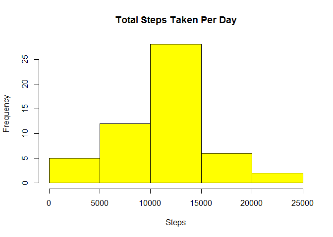
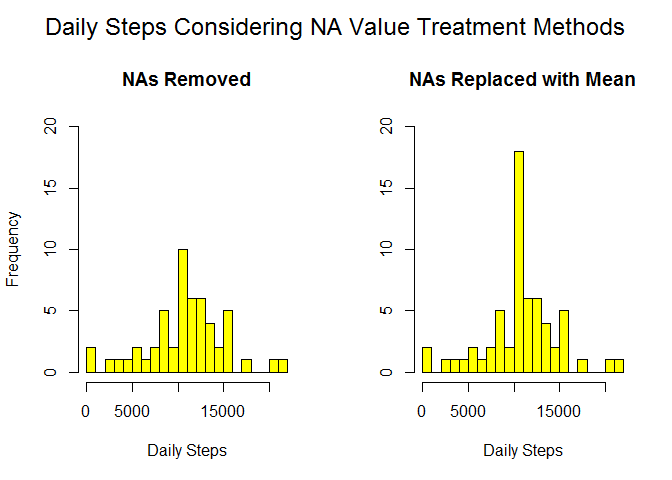
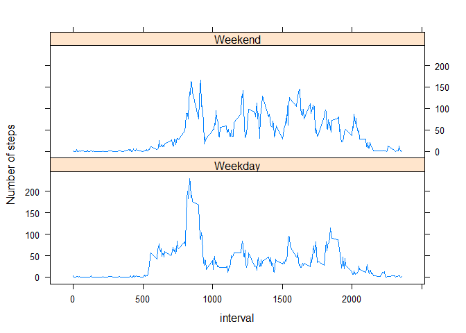

## Loading and preprocessing the data


```r
#Download the data
    filename <- "Coursera_RR_Assignment1.zip"
    
    # Checking if archieve already exists.
    if (!file.exists(filename)){
        fileURL <- "https://d396qusza40orc.cloudfront.net/repdata%2Fdata%2Factivity.zip"
        download.file(fileURL, filename, method="curl")
    }  
    
    # Checking if the unzipped folder exists and unzip if it doesn't
    if (!file.exists("activity.csv")) { 
        unzip(filename) 
    } else { 
        print("File exists")
    }
```

```
## [1] "File exists"
```

```r
    library("pacman")
    pacman::p_load(readr, dplyr, knitr, ggplot2, chron, lattice)
```


```r
    # Import the data and review it
    rawData <- read.csv("activity.csv", stringsAsFactors = FALSE)
    summary(rawData)
```

```
##      steps            date              interval     
##  Min.   :  0.00   Length:17568       Min.   :   0.0  
##  1st Qu.:  0.00   Class :character   1st Qu.: 588.8  
##  Median :  0.00   Mode  :character   Median :1177.5  
##  Mean   : 37.38                      Mean   :1177.5  
##  3rd Qu.: 12.00                      3rd Qu.:1766.2  
##  Max.   :806.00                      Max.   :2355.0  
##  NA's   :2304
```

```r
    data <- rawData
```

## What is the mean total number of steps taken per day?

For this part of the assignment, we can ignore the missing values in the data set.


```r
    data <- na.omit(data)
```

1) Calculate the total number of steps taken per day

```r
    data$date <- as.Date(data$date)
    dailySteps <- data%>%
                    group_by(date) %>%
                    summarise(steps=sum(steps))
    hist(dailySteps$steps, main="Total Steps Taken Per Day", xlab = "Steps", col = "Yellow")
```

<!-- -->

2) Calculate and report the mean and median of the total number of steps taken per day


```r
    summary <- dailySteps %>%
                summarise(meanSteps = mean(steps),
                            medianSteps = median(steps))
```
The following table presents the mean and median of the total number of steps taken per day (between 2012-10-02 and 2012-11-29.


```r
    kable(summary, format.args = list(big.mark = ","), 
          format = "markdown", 
          align = 'c', padding = 20, 
          col.names = c("Mean Daily Steps", "Median Daily Steps"))
```


|                    Mean Daily Steps                    |                    Median Daily Steps                    |
|:------------------------------------------------------:|:--------------------------------------------------------:|
|                       10,766.19                        |                          10,765                          |
## What is the average daily activity pattern?

1) Make a time series plot (i.e.`type = "l"`) of the 5-minute interval (x-axis) and the average number of steps taken, averaged across all days (y-axis)


```r
    avInt <- data %>%
                group_by(interval) %>%
                summarise(meanSteps = mean(steps))
    
    maxSteps <- avInt[which.max(avInt$meanSteps),1]

    plot(avInt$meanSteps~avInt$interval, type = "l", 
         main = "Mean Number of Steps Averaged Across All Days",
         xlab = "Daily 5 Minute Time Interval", ylab = "Average Number of Steps Per Day")
    abline(v = maxSteps, col = "lightgrey", lty = 3)
    text(x=maxSteps, y=max(avInt$meanSteps), paste("< peak occurs at interval",maxSteps), col = "red", srt = 0, pos = 4)
```

<!-- -->

2) Which 5-minute interval, on average across all the days in the data set, contains the maximum number of steps?

The 835^th^ 5-minute interval, on average across all the days in the data set, contains the maximum number of steps.

## Imputing missing values

Note that there are a number of days/intervals where there are missing values (coded as `NA`). The presence of missing days may introduce bias into some calculations or summaries of the data.

1) Calculate and report the total number of missing values in the data set (i.e. the total number of rows with `NA`s).

```r
    nas <- sum(is.na(rawData$steps))
```

There are 2,304 NA Values in the imported data set.

2) Devise a strategy for filling in all of the missing values in the data set. The strategy does not need to be sophisticated. For example, you could use the mean/median for that day, or the mean for that 5-minute interval, etc.

For the this problem, I opted to replace NA values with the mean interval values and then merge the outputs to the corresponding NA values for that interval.

```r
    meanNa <- data %>%
                group_by(interval) %>%
                summarise(meanSteps = mean(steps)) # calculate the mean values per interval
    
    naVal <- rawData[is.na(rawData$steps),] # Create a data frame with only the na values
```

3) Create a new data set that is equal to the original data set but with the missing data filled in.

```r
    naRep <- left_join(meanNa, naVal, by = "interval") # Join the mean steps to the na values
    names(naRep)[2] <- "steps" # Change the name of the column for rbinding
    dataNew <- rbind(data, naRep[,c(2,4,1)]) # Combine the data
    dataNew$RepNaMethod <- "Replaced With Mean"
    data$RepNaMethod <- "Removed"
    identical(nrow(dataNew), nrow(rawData)) # Check the number of rows against the original
```

```
## [1] TRUE
```
There are 0 NA values in the new data set.

4) Make a histogram of the total number of steps taken each day and Calculate and report the mean and median total number of steps taken per day. Do these values differ from the estimates from the first part of the assignment? What is the impact of imputing missing data on the estimates of the total daily number of steps?


```r
    dataNewDaily <- dataNew %>%
                        group_by(date, RepNaMethod) %>%
                        summarise(steps=sum(steps))

    dailySteps$RepNaMethod <- "Removed"
    combineddf <- rbind(as.data.frame(dataNewDaily[,c(1,3,2)]), dailySteps)
    
    par(mfrow=c(1,2),oma = c(0, 0, 2, 0))
    hist(dailySteps$steps, main="NAs Removed", 
         xlab = "Daily Steps", col = "Yellow", ylim=c(0,20), 
         breaks = 20)
    hist(dataNewDaily$steps, main="NAs Replaced with Mean", 
         xlab = "Daily Steps", col = "Yellow", ylim=c(0,20), 
         breaks = 20, ylab = "")
    mtext("Daily Steps Considering NA Value Treatment Methods", outer = TRUE, cex = 1.5)
```

<!-- -->


```r
    newSummary <- dataNewDaily[,c(-1,-2)] %>%
                    summarise(meanSteps = mean(steps),
                            medianSteps = median(steps))   

    kable(newSummary, format.args = list(big.mark = ","), 
          format = "markdown", 
          align = 'c', padding = 20, 
          col.names = c("Mean Daily Steps", "Median Daily Steps"))
```


|                    Mean Daily Steps                    |                    Median Daily Steps                    |
|:------------------------------------------------------:|:--------------------------------------------------------:|
|                       10,766.19                        |                        10,766.19                         |
Based on the above findings, the mean and median are the same. This implies that the distribution is more symmetrical. This is most likely due to the central values seemingly containing the missing values, which makes sense considering the NA values were replaced using an averaging method.

The following distribution demonstrates a potentially more symmetrical view when comparing the NA value treatment methods.


```r
    ggplot() +
        geom_density(data=combineddf,aes(x=steps, fill = RepNaMethod), alpha = 0.8) +
        labs(title = "Denisity Plot Comparison Using Replaced and Removed NA values",
             fill="NA Value Treatment Method") +
        theme_bw()
```

<!-- -->

## Are there differences in activity patterns between weekdays and weekends?
For this part the `weekdays()` function may be of some help here. Use the data set with the filled-in missing values for this part.

1) Create a new factor variable in the data set with two levels – “weekday” and “weekend” indicating whether a given date is a weekday or weekend day.

```r
    dataNew$weekType <- ifelse(weekdays(dataNew$date) %in% c("Saturday", "Sunday"), "Weekend", "Weekday")
```

2) Make a panel plot containing a time series plot (i.e. `type="l"`) of the 5-minute interval (x-axis) and the average number of steps taken, averaged across all weekday days or weekend days (y-axis). See the README file in the Git Hub repository to see an example of what this plot should look like using simulated data.


```r
weekActivity <- dataNew %>%
    group_by(weekType, interval) %>%
    summarise(Nsteps = mean(steps))
    
    xyplot(Nsteps ~ interval | weekType, data = weekActivity, type = "l", layout = c(1,2), ylab = "Number of steps") # show points
```

<!-- -->

